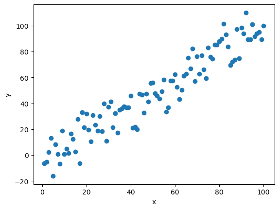
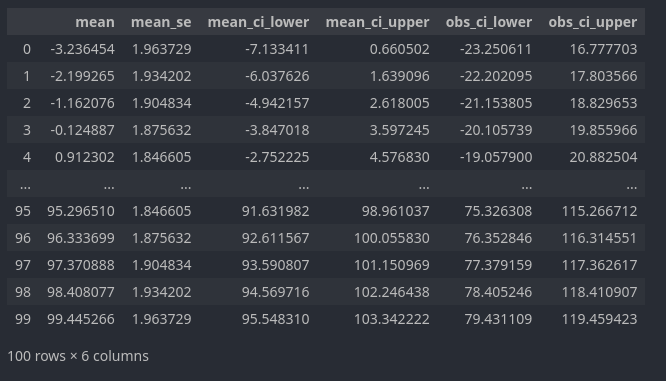
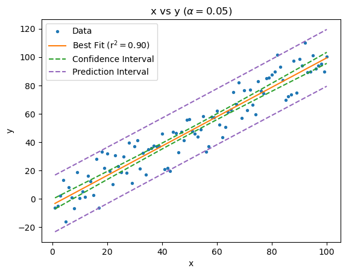

## Introduction

Confidence intervals are a metric of uncertainty within [sample](https://www.investopedia.com/terms/s/sample.asp) datasets and as such can be used as a metric of determining how good an estimate is. 

In the context of linear regression, we can use a confidence interval to find the region would contain the line of best fit for 95% percent of samples. This meaning that if hypothetically we could redraw our data sample infinite times, 95% of the time the resulting line of best fit will fall within the bound of the interval. Note that this is different than saying the line of best fit has a 95% probability of falling within the interval bounds. Nonetheless, so long as our dataset sample is representative of the true [population](https://www.investopedia.com/terms/p/population.asp), the confidence interval more or less shows use where we expect the true line of best fit to be.

Beyond that we have the prediction interval. The prediction interval corresponds to the real values/observations, as opposed to the line of best fit. This meaning that if we could infinitely redraw our sample, 95% of values will lie within the prediction interval. This of course means that the prediction interval for the model will be wider than the confidence interval.  

## Modeling

### Our Sample

First things first we need some sample data. To do so, I'll create a rather simple dataset with some normally distributed noise added to the `y` (dependent) value. 

```python
import pandas as pd
import numpy as np

df = pd.DataFrame()
df['x'] = np.arange(1,101)
df['y'] = np.arange(1,101) + np.random.normal(0,10,100)
```

This produces a plot that will look like this:



### Modeling 

The next step is to create and fit the linear regression. For this purpose I will be leveraging `statsmodels` and using `OLS` (ordinary least squares) linear regression. I'll explain shortly why I've chosen `statsmodels` as opposed to other packages like `sklearn`.

```python
import statsmodels.api as sm

# defining our X and Y
X = sm.add_constant(df['x'])
Y = df['y']

# setting up our model
model = sm.OLS(Y,X)
# fitting
fit = model.fit()
```

Quick note regarding `sm.add_constant(df['x'])` (line 4). The reason why this is necessary is because `statsmodels` can fit the data to either `y = m(x)` (this is if you omitted line 4) or `y = b + m(x)`, the latter in reality being `y = b(constant) + m(x)`. So `sm.add_constants()` adds a dimension to the `x` (independent) data series such that a constant intercept is fitted. 

Meaning `sm.add_constants([1,2,3])` outputs `[[1,1], [1,2], [1,3]]`

### Calculating Model Predictions and Intervals

Now that we have our model, we can use it to get prediction for a given `x` value (`mean`), the standard deviation of the predicted mean (`mean_se`), as well as the lower and upper bounds for both the confidence and prediction intervals.

```python
# create a series for the entire x range, with 100 points
xline = np.linspace(df['x'].min(), df['x'].max(), 100)

# getting the summary dataframe 
# with a alpha=0.05 which corresponds to 
# a 95% confidence interval
df_predict = results.get_prediction(sm.add_constant(xline)).summary_frame(alpha=0.05)
```



In which the predictions (technically predicted mean for the x value) correspond to `mean`, `mean_se` to the standard deviation for the predicted mean, `mean_ci_lower` and `mean_ci_upper` to the lower and upper bounds of the 95% confidence interval, and finally `obs_ci_lower` and `obs_ci_upper` to the lower and upper bounds of the 95% prediction interval.

It's for this very function that I've chosen to use `statsmodel` for the linear regression as the `summary_frame` (line 7) method makes calculating the intervals easy.

## Plotting

Now that we have all of our data and calculations, all that is left is to make the actual plot.

```python
import matplotlib.pyplot as plt

# plot the data point in our sample dataset
# s=8 set the point size
plt.scatter(df['x'], df['y'], s=8, label='Data')

# plotting our predicted line (line of best fit)
plt.plot(xline, df_predict['mean'],
        color='C1', label=f'Best Fit (r$^2 = {results.rsquared:.2f}$)'
)

# plotting the lower and upper confidence interval bounds
plt.plot(xline, df_predict['mean_ci_lower'], linestyle='--', color='C2', label='Confidence Interval')
plt.plot(xline, df_predict['mean_ci_upper'], linestyle='--', color='C2')

# plotting the lower and upper prediction interval bounds
plt.plot(xline, df_predict['obs_ci_lower'], linestyle='--', color='C4', label='Prediction Interval')
plt.plot(xline, df_predict['obs_ci_upper'], linestyle='--', color='C4')

plt.xlabel('x')
plt.ylabel('y')
plt.legend()
plt.title(f"x vs y ($\\alpha=0.05$)")
plt.show()
```

And there we go. 



Since we're using normally distributed data (remember "Our Sample" above) the plot looks fairly tame but with real world data often time the bounds can be wider with more curvature. 