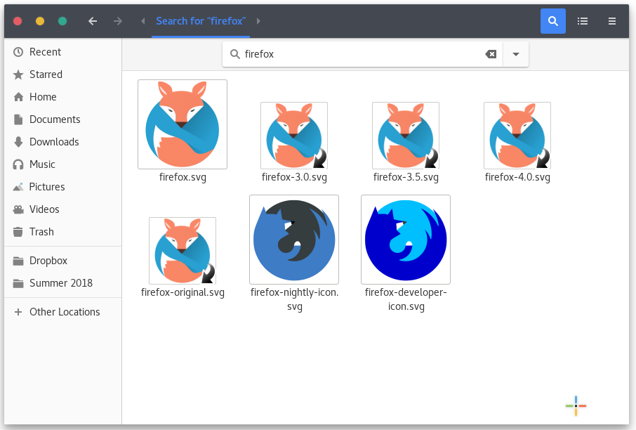
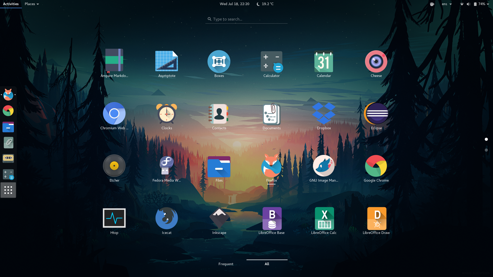

*This article was originally written by me for UMass IT Techbytes Blog. Since then the blog has been discontinued. This article is republished here for archival purposes, the original can still be found [here](https://blogs.umass.edu/Techbytes/2019/02/27/quick-guide-to-patching-linux-icon-packs/).*

One of the nice advantages of using Linux is the wealth of customization options available. A key area of  that customization are app icons. For those unfamiliar, it is similar to how icons change across Android versions, even though the apps themselves are often the same.

Now I could go over how to install icons packs, however there are countless sites who already explain the process very well, such as [Tips on Ubuntu](http://tipsonubuntu.com/2016/09/11/install-gtk-icon-themes-ubuntu-16-04/). As for obtaining icon packs, a great site is [OpenDesktop.org](https://www.opendesktop.org/), which among other things hosts a wide variety of free to use icon packs.

So, now onto something less commonly covered, patching icon sets (no coding or art skills required). First a little background, if you use one of the more popular icon packs, you’ll likely have no issues. However many of the smaller icon packs either only support certain distros or lack icons for lesser known programs.

Take for example my all time favorite icon pack, [Oranchelo](https://github.com/OrancheloTeam/oranchelo-icon-theme), it is geared mainly towards Ubuntu. Lately I’ve been using Fedora 28 and while some icons work liked they’re supposed to, others, which work in Ubuntu, do not. So why is that?

Each program has an icon name, and while many programs keep a consistent icon name across distros, this is not always the case, such as with some of the default Gnome apps in Fedora vs Ubuntu. To fix this we need to either change the app’s icon name or create symbolic links to the current icon name, the latter generally being the better option.

First we need to find the current icon name, for all common (and probably for the uncommon ones as well) Linux desktop environments the way to do this is:

```bash
cd /usr/share/applications/
```

Here you will see (using the ls command) a bunch of .desktop files, these are config files that set how a program will be shown on the desktop, such as what will it be called under English or under Polish, as well as what the icon should be.

I’ve already patched Oranchelo for most of my applications but I’ve yet to do it for the IceCat browser (located towards the bottom on the screenshot), so I’ll use it as an example.


Since we already have our terminal located in the right folder, lets just search for the right .desktop file:

```bash
ls | grep -i icecat
```

From that command we now know that full name of the file is “icecat.desktop”. Now that we see the file, we just need to find what it’s icon name is:

```bash
cat icecat.desktop | grep -i icon
```

Now that we know what the icon is called (“icecat”, icon names aren’t always this simple), we needed to open up our installed icon pack, if you’re not sure where that is, look back on the install instructions you used for your pack and just find where you placed said pack.

I generally prefer to look at the icons in a graphical file manager, so that I can make sure I pick the right one.

So now that we’re in the file, we want to go into apps, then scalable. Here we have all our icons, once we found one that we like, we need to create a symbolic link.

Since Oranchelo doesn’t currently have an Icecat logo, I will use the Firefox Nightly icon.



Now we need to open a terminal at this location and do the following command (depending on where you installed your icons, you may or may not need to use `sudo`)

```bash
ln -s icon.svg desiredApp.svg
```

Or in my case:

```bash
ln -s firefox-nightly-icon.svg icecat.svg
```

Now all we need to do is toggle the icons, simply switch to the system default icon set and then switch back and the correct icons will show.

As you can see, the desired icon is now set for Icecat



However this is not the only way to patch icon sets, some icon sets are designed to only replace a small amount of icons, such as folders. These often use inheritance to fill the void, however you may not always like the set from which they inherit the remainder, or you may simply prefer if it inherited from a different set.

One of my favorite Gnome themes, [Canta](https://www.gnome-look.org/p/1220749/), comes with its own icon pack that replaces folders but inherits the rest from [Numix](https://github.com/numixproject/numix-icon-theme-circle) icon pack, but since I haven’t installed [Numix](https://www.gnome-look.org/content/show.php/Super+flat+remix+icon+theme?content=169073), it defaults to the system default. However, I have the Flat Remix pack installed, I’ll make it instead inherit from that.


As before, we need to go into the icon pack folder. Once we’re in the canta icon pack, we need to open up the index.theme file with a text editor (as before, depending on where it is installed, you may or may not need sudo).

A few lines from the bottom you will see a “Inherits=”. For Canta it is:

```
"Inherits=Numix-Circle,Adwaita,gnome,hicolor"
```

So if we want it to inherit from flat remix (provided flat remix is installed correctly), all we need to do is add it in, changing the line to:

```
"Inherits=Flat-Remix,Numix-Circle,Adwaita,gnome,hicolor"
```

Once you save the file, all the missing icons should be automatically inherited from Flat Remix.

