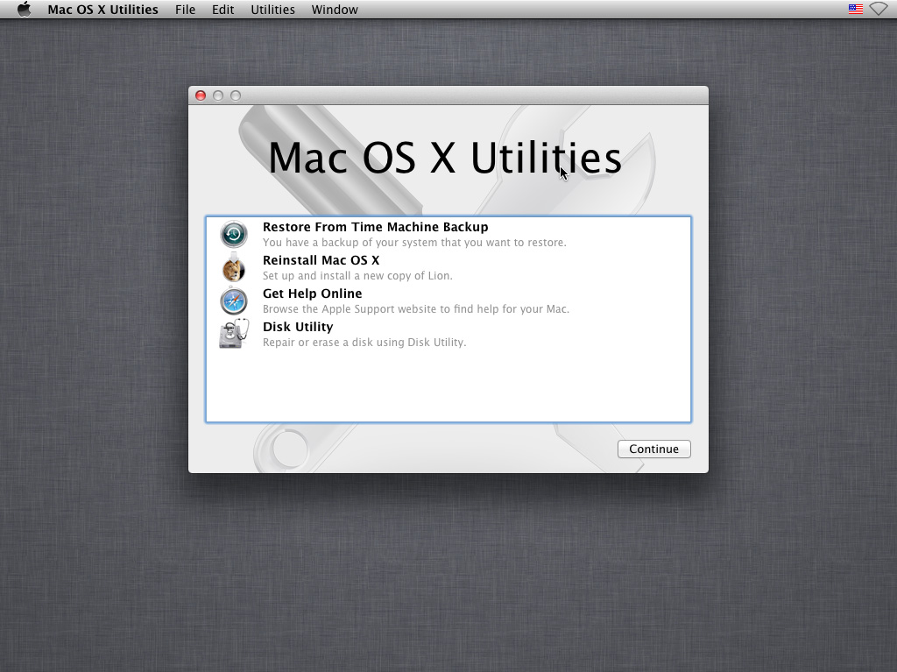
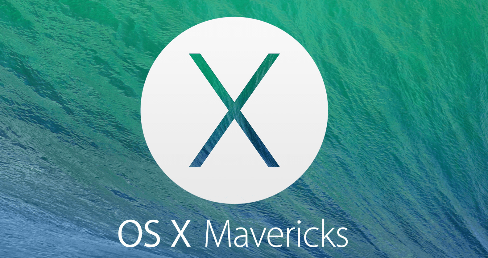
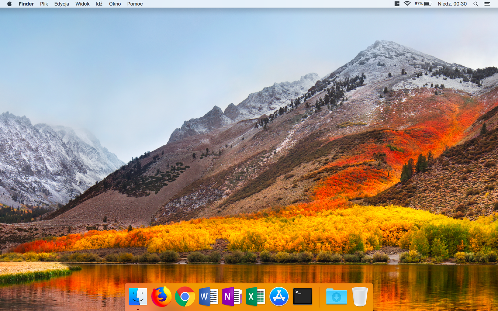

*This article was originally written by me for UMass IT Techbytes Blog. Since then the blog has been discontinued. This article is republished here for archival purposes, the original can still be found [here](https://blogs.umass.edu/Techbytes/2018/04/06/restoring-a-macbook-with-an-erased-hard-drive/).*

If you’re anything like me, you will (or already have) accidentally wiped your MacBook’s SSD. It may seem like you just bricked your MacBook, but luckily there is a remedy.

The way forward is to use the built-in “internet recovery” which, on startup, can be triggered via pressing `cmd + R`.

There is a bit of a catch: if you do this straight away, there is a good chance that the Mac will get stuck here and throw up an error – error `-3001F` in my personal experience. This tends to be because the Mac assumes it is already connected to WiFi (when its not) and gives an error after it fails to connect to apple servers. If instead your MacBook lets you select a WiFi network during this process, you’re in the clear and can skip the next paragraph.

Luckily there is another way to connect, via apple’s boot menu. To get there, power the computer on, hit the power button and very soon after, hold the option key. Eventually you will see a screen where you can pick a WiFi network.

Unfortunately if you’re at UMass, `eduroam` (or `UMASS`) won’t work, however you can easily connect to any typical home WiFi or a mobile hotspot (although you should make sure you have unlimited data first).

Once you’re connected, you want to hit `cmd + R` from that boot screen. Do not restart the computer. If you had been able to connect without the boot menu, you should be already be in internet recovery and do not need to press anything.

Now that the WiFi is connected, you need to wait. Eventually you will see the MacBook’s recovery tools. First thing you need to do is to select disk utility, select your MacBook’s hard drive and hit erase – this may seem redundant but I’ll explain in a moment. Now go back into the main repair menu by closing the disk utility.

Unless you created a “time machine” backup, you’ll want to pick the reinstall Mac OS X option. After clicking through for a bit, you will see a page asking you to select a drive. If you properly erased the hard drive a few moments before, you will be able to select the hard drive and continue on. If you hadn’t erased the drive again, there is a good chance no drive will appear in the drive selection. To fix that, all you have to do is to erase the drive again with the disk utility mention earlier – the one catch is that you can only get back to the recovery tools if you restart the computer and start internet recovery again, which as you may have noticed, is a slow process.

Depending on the age of your MacBook, there is a solid chance that you will end up with an old version of Mac OS. If you have two step verification enabled, you may have issues updating the the latest Mac OS version.

Out of my own experience, OS X Mavericks will not allow you to login to the app store if you have two step verification – but I would recommend trying, your luck could be better than mine. The reason why we need to App Store is because it is required to upgrade to High Sierra/the present version of OS X.

If you were unable to login, there is a work around – that is to say, OS X Mavericks will let you make a new Apple ID, which luckily are free. Since you will be creating this account purely for the sake of updating the MacBook, I wouldn’t recommend using your primary email or adding any form of payment to the account.

Once you’re logged in, you should be free to update and after some more loading screens, you will have an fully up-to-date MacBook. The last thing remaining (if you had to create a new Apple ID) is to log out of the App Store and login to your personal Apple ID.

