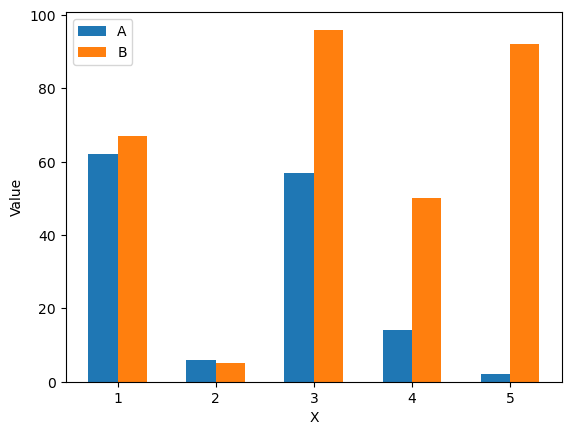

## Introduction

Plotting a simple bar plot with `matplotlib` is relatively simple, essentially it is done by manipulating the `x` coordinate based on the width of the bar plot. 

```python
import pandas as pd
import matplotlib.pyplot as plt
import numpy as np

# create sample data
df = pd.DataFrame()
df['X'] = [1, 2, 3, 4, 5]
df['A'] = np.random.randint(0,100,size=5)
df['B'] = np.random.randint(0,100,size=5)

# plot
width=.3 # this is important
plt.bar(df['X']-(width/2), df['A'], width=width, label='A')
plt.bar(df['X']+(width/2), df['B'], width=width, label='B')

# add labels and legends to plot
plt.legend()
plt.xlabel('X')
plt.ylabel('Value')
```



To summarize the code, the width is manually set, then based of the width we use a simple calculation to center the bars around the point. So since we have two categories, to center we need to subtracted half the width from the left column and add half the width to the right.

### Bar Plot with Categories on X

A slightly more advanced plot has categories in the X axis. The example borrowed from the **[official documentation](https://matplotlib.org/stable/gallery/lines_bars_and_markers/barchart.html)**.

```python
# this example is from https://matplotlib.org/stable/gallery/lines_bars_and_markers/barchart.html
# data from https://allisonhorst.github.io/palmerpenguins/

import matplotlib.pyplot as plt
import numpy as np

species = ("Adelie", "Chinstrap", "Gentoo")
penguin_means = {
    'Bill Depth': (18.35, 18.43, 14.98),
    'Bill Length': (38.79, 48.83, 47.50),
    'Flipper Length': (189.95, 195.82, 217.19),
}

x = np.arange(len(species))  # the label locations
width = 0.25  # the width of the bars
multiplier = 0

fig, ax = plt.subplots(layout='constrained')

for attribute, measurement in penguin_means.items():
    offset = width * multiplier
    rects = ax.bar(x + offset, measurement, width, label=attribute)
    ax.bar_label(rects, padding=3)
    multiplier += 1

# Add some text for labels, title and custom x-axis tick labels, etc.
ax.set_ylabel('Length (mm)')
ax.set_title('Penguin attributes by species')
ax.set_xticks(x + width, species)
ax.legend(loc='upper left', ncols=3)
ax.set_ylim(0, 250)

plt.show()
```


## Grouped Bar Plot with Time Series


