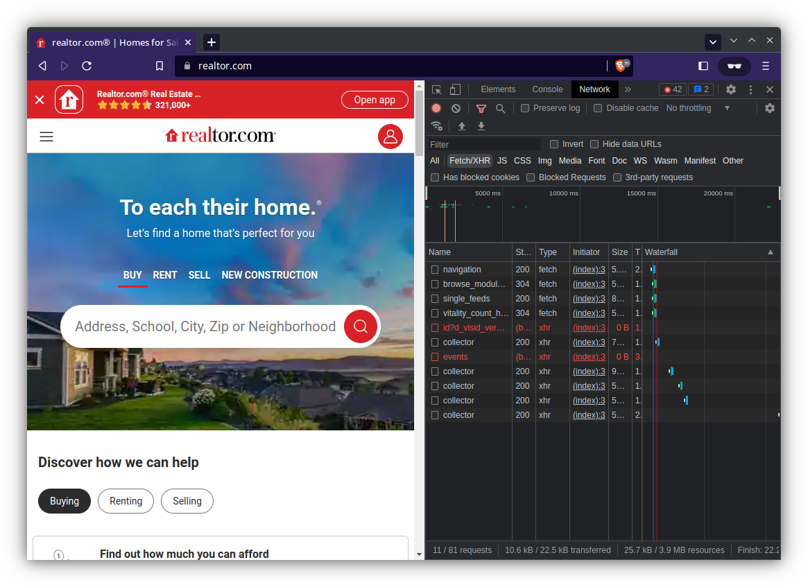

This article as well as most of my [web scraping articles]( "web scraping") are heavily inspired based on [John Watson Rooney's](https://www.youtube.com/@JohnWatsonRooney) [video](https://youtu.be/DqtlR0y0suo) on the subject.

## Overview

Any public website can be scraped, the only question is how and is the effort worth it?

Some websites are relatively simple, take for instance this very site. On the other hand, take Google Maps, the public facing API of maps is intentionally convoluted and while I believe it is theoretically possible scrape it, the more programmatic approach is to just sign up for a Google Maps API key.

## How Websites Work

Whenever you connect to a server, you send a request to that server to get the information (the webpage) assigned to the URL. In simple static websites, that might just be a single `GET` request that gets the HTML content of the page. Then you can use an HTML parser such as `BeautifulSoup4` in Python to parse the content. Simple.

However most websites, at least most websites worth scraping, are not as simple. They will often have client side javascript that have one or more APIs calls that pull from one or more databases, loading all said information asynchronously. In that case simply sending a `GET` request for the HTML page is not going to be sufficient, all you will get is a template with the key data missing. 

### Public APIs

Although you may not realize it, when you open a website like [realtor.com](https://www.realtor.com/) multiple API requests will fire which obtain information not included on the HTML page source, such as active property listings.



For the purpose of this article I will be showcasing a simpler website, if you are interested in see how to scrape realtor.com, see [this article]().

## Reverse Engineering Public APIs

I'll be extracting all the symbol tickers on the NYSE (New York Stock Exchange) from [NYSE Symbols Table](https://www.nyse.com/listings_directory/stock).

### Identifying the API

To start off with, we need to identify the API. The best way is to use a Chromium based browser (Chrome, Brave, etc.) such that we can take advantage of the advanced developer tools. 

1. Open [nyse.com/listings_directory/stock](https://www.nyse.com/listings_directory/stock)
2. Right click on the page and click `Inspect`
3. This opens up right side menu with the developer tools
4. In the side menu, open the `Network` tab
5. Under the filter box, select `Fetch/XHR` 
   * This will show just the API requests
6. Click through the table and observe which network requests are being made 


You can see that request named `filter` is the one that is fetching the data.


### Understanding the API

Now that we've identified the API, the trick is to understand (at least partially) how it works. This is where an API debugger comes in.

Although we could manually try to tinker with the API request, using an API debugger makes like significantly easier. My go-to debugger is [Insomnia](https://insomnia.rest/) which is a free and open source application. 

So let's get started...

1. In the DEV tools, right click the `filter` request, hover over `copy`, then click `copy as cURL`


1. Open Insomnia and paste the `cURL` you just copied
   * Insomnia will automatically parse the `cURL` request
2. Click `Send` in Insomnia
   * You should see a green `200 OK` and  some stock tickers in the preview.


Let's look at the request JSON...

```json
{
    "instrumentType":"EQUITY",
    "pageNumber":2,
    "sortColumn":"NORMALIZED_TICKER",
    "sortOrder":"ASC",
    "maxResultsPerPage":10,
    "filterToken":""
}
```

After some tinkers, we can see that changing `pageNumber` will let use cycle through all the symbol tickers. So we can iterate through `pageNumber` then parse the response JSON to get all the tickers. However we still need to determine what happens when we hit the end. 

If we try `"pageNumber":1000`, we will get a `500 Internal Server Error`. This is a good thing, we now have a defined start point (`"pageNumber":1`) and the end point (status code `500`).


### Generating Code

One of the perks of Insomnia is that it can generate code snippets for a variety of languages, such as Python.


In that there are certain headers that are not strictly needed, such as cookies, typically these can be removed without any problem. 

```python
import requests

url = "https://www.nyse.com/api/quotes/filter"

payload = {
    "instrumentType": "EQUITY",
    "pageNumber": 1,
    "sortColumn": "NORMALIZED_TICKER",
    "sortOrder": "ASC",
    "maxResultsPerPage": 10,
    "filterToken": ""
}
headers = {
    "Accept": "*/*",
    "Accept-Language": "en-US,en;q=0.8",
    "Connection": "keep-alive",
    "Content-Type": "application/json",
    "Origin": "https://www.nyse.com",
    "Referer": "https://www.nyse.com/listings_directory/stock",
    "Sec-Fetch-Dest": "empty",
    "Sec-Fetch-Mode": "cors",
    "Sec-Fetch-Site": "same-origin",
    "Sec-GPC": "1",
    "User-Agent": "Mozilla/5.0 (X11; Linux x86_64) AppleWebKit/537.36 (KHTML, like Gecko) Chrome/110.0.0.0 Safari/537.36"
}

response = requests.request("POST", url, json=payload, headers=headers)

print(response.text)
```

## Putting it all Together

Now all that's needed is to iterate over the pages, with the status code `500` representing the end condition. 

```python
import requests

url = "https://www.nyse.com/api/quotes/filter"

headers = {
    "Accept": "*/*",
    "Accept-Language": "en-US,en;q=0.8",
    "Connection": "keep-alive",
    "Content-Type": "application/json",
    "Origin": "https://www.nyse.com",
    "Referer": "https://www.nyse.com/listings_directory/stock",
    "Sec-Fetch-Dest": "empty",
    "Sec-Fetch-Mode": "cors",
    "Sec-Fetch-Site": "same-origin",
    "Sec-GPC": "1",
    "User-Agent": "Mozilla/5.0 (X11; Linux x86_64) AppleWebKit/537.36 (KHTML, like Gecko) Chrome/110.0.0.0 Safari/537.36"
}

page = 1
data = []

while True:
    payload = {
        "instrumentType": "EQUITY",
        "pageNumber": page,
        "sortColumn": "NORMALIZED_TICKER",
        "sortOrder": "ASC",
        "maxResultsPerPage": 10,
        "filterToken": ""
    }

    print(f"scraping page {page}", end="\r")
    response = requests.request("POST", url, json=payload, headers=headers)

    if response.status_code != 200:
        print("Done!             ")
        break

    data.append(response.json())
    page += 1
```

Beyond that, multi-threading could be used speed up the the data fetching, but that's another topic.